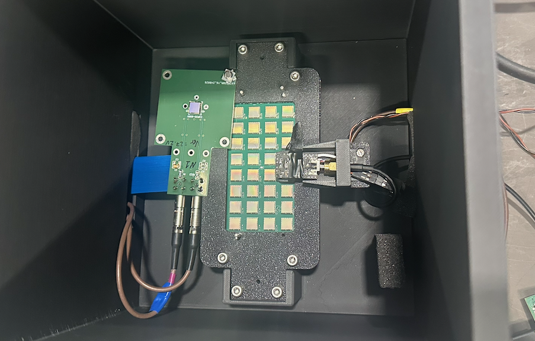
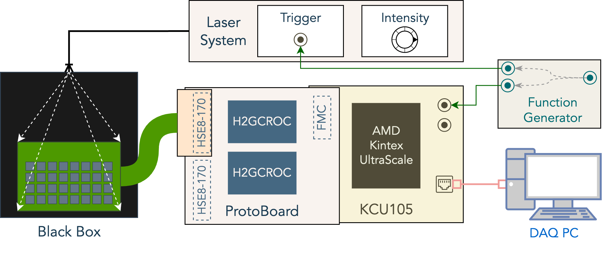

# Shihai's Laser Injection Data Analysis

## Introduction

This data analysis is based on the KCU105-based data analysis for the laser injection experiment conducted in the FoCal Lab at CERN.

#### Test setup

The test setup is based on the H2GCROC3D ASICs, Xilinx KCU105 FPGA board, and a laser injection system.
The laser signal is **NOT** synchronized with the clock of the ASICs, and the laser itself is difused by a piece of tape, which distributes the light over a larger area of the sensor but **NOT** evenly.




## Data Processing

This project converts raw H2GCROC `.h2g` data into event-matched ROOT files, performs per-run ADC and ToT analyses, and then combines runs into laser-intensity scans. The analysis is currently configured for channels 50 and 52; channels 54 and 58 are retained as covered reference channels in the single-run analyses.

### Repository layout

The main subfolders are organized as follows:

```
.
├── doc/                # Documentation and images
├── data/               # Raw data files
├── src/                # Source code for libraries
├── include/            # Header files for libraries
├── logs/               # Log files from data processing
├── config/             # Configuration files
├── build/              # Build files for the project
├── scripts/            # Scripts for data processing and analysis
├── dump/               # Generated files from data processing
├── workflow/           # Snakemake workflow rule files for automation
└── readme.md           # This file
```

### Requirements and build

The analysis requires a C++17 compiler, CMake 3.12 or newer, OpenMP, and a ROOT installation with the `Core`, `Graf`, `RIO`, `Tree`, `Gpad`, `Hist`, `Thread`, `MathCore`, and `ROOTDataFrame` components. The build downloads `argparse`, `easylogging++`, `nlohmann/json`, and `csv-parser` through CMake `FetchContent`, so network access is needed for a clean build.

Before configuring, set `MY_ROOT_DIR` in `CMakeLists.txt` to the root of the local ROOT installation. A Conda environment can introduce conflicting libraries and should be deactivated when configuring the project.

```bash
cmake -S . -B build -DCMAKE_BUILD_TYPE=Release
cmake --build build --parallel
```

Every `scripts/*.cxx` file is built as an executable with the same basename in `build/`. For example, `scripts/401_ADC_Analysis.cxx` becomes `build/401_ADC_Analysis`.

### ROOT conversion

The conversion chain must be run in the following order:

1. `103_Rootifier_10G` decodes a raw `.h2g` file into a ROOT `data_tree` and records the valid FPGA identifiers.
2. `101_EventRecon` groups the decoded data into machine-gun events. The reconstruction currently forces 20 samples per event.
3. `102_EventMatch` aligns the reconstructed events across FPGAs and writes the matched event tree used by the downstream analyses.

For example, to process `Run087`:

```bash
build/103_Rootifier_10G -f data/Run087.h2g -o dump/103_Rootifier_10G/Run087.root
build/101_EventRecon -f dump/103_Rootifier_10G/Run087.root -o dump/101_EventRecon/Run087.root
build/102_EventMatch -f dump/101_EventRecon/Run087.root -o dump/102_EventMatch/Run087.root
```

These programs accept `-e <number>` to limit the number of processed events. The reconstruction and matching stages also accept `-v` for verbose logging. Each command requires an existing input file and a `.root` output path.

### Single-run ADC and ToT analysis

The matched ROOT file is the input to the ADC and ToT analyses. Both programs read the event metadata and produce a ROOT file containing histograms and canvases for the selected channels.

```bash
build/401_ADC_Analysis -f dump/102_EventMatch/Run087.root -o dump/401_ADC_Analysis/Run087.root
build/404_ToT_Analysis -f dump/102_EventMatch/Run087.root -o dump/404_ToT_Analysis/Run087.root
```

Use `-e <number>` to process only part of a run, and `--focal` to select the FoCal mapping when appropriate. Existing outputs show that `401_ADC_Analysis` produces the ROOT result together with PDFs such as `Run087.root_unfiltered_channel_50.pdf` and `Run087.root_channel_50_toa_shifted_waveform.pdf`; analogous files are written for channel 52. `404_ToT_Analysis` produces the per-run ToT ROOT results used by the ToT scan.

### Scan configuration

Each `config/scan_number_*.json` file defines one laser-intensity scan. It contains the front-end settings, the ordered run list, and the matching laser intensities. For example:

```json
{
	"scan_brief": "Scan description",
	"scan_bias": 45,
	"scan_CC": 4,
	"scan_Cf": 10,
	"scan_Cfcomp": 10,
	"example_channels": [50, 52],
	"run_numbers": [299, 300],
	"laser_intensities": [10.0, 9.8]
}
```

The `run_numbers` and `laser_intensities` arrays must have the same ordering. Run the single-run analyses for every listed run before creating a scan.
The optional `example_channels` array selects the channels included by the ADC
and ToT scan programs. When it is absent, the scan programs inherit the
channels available in the single-run ADC and ToT analysis outputs.

```bash
build/402_ADC_Scan -f config/scan_number_0.json -o dump/402_ADC_Scan/Scan0.root
build/405_ToT_Scan -f config/scan_number_0.json -o dump/405_ToT_Scan/ToTScan0.root
```

`402_ADC_Scan` reads `dump/401_ADC_Analysis/RunNNN.root` and writes combined peak distributions, mean ADC peak versus laser intensity, and resolution versus mean plots. In addition to `Scan0.root`, it writes PDFs such as `Scan0_channel_50.pdf`, `Scan0_mean_peak_vs_laser_channel_50.pdf`, and `Scan0_resolution_vs_mean_channel_50.pdf`, with corresponding channel-52 files. `405_ToT_Scan` reads both the ADC and ToT per-run ROOT files and produces the corresponding ToT scan result.

### Cross-scan comparisons

Files named `config/laser_scan_*.json` group several numbered scans. They contain `scan_data`, `scan_configs`, and `scan_config_labels`; the provided configuration uses `scan_data: "ADC"` and references the numbered scan JSON files.

```bash
build/403_Laser_Scan -f config/laser_scan_0.json -o dump/403_Laser_Scan/LaserScan0.root
```

`403_Laser_Scan` combines the ADC scan curves and fits their unsaturated region, using points with mean ADC values between 200 and 950. `407_ToT_Laser_Scan` performs the analogous ToT comparison when its input configuration has `"scan_data": "ToT"` and the referenced `dump/405_ToT_Scan/ToTScanN.root` files exist.

The remaining programs support specialised comparisons:

- `406_ADC_ToT_Combine` combines ADC and ToT information for one matched run. Its current implementation loads the LUT `dump/405_ToT_Scan/ToTScan5.root_LUT_Channel_50.txt`.
- `408_Slope_Compare_ADC_ToT` compares ADC slopes with ToT scale-similarity results using the input and output paths currently defined in its source file.
- `409_ToT_Recover` recovers a matched ToT/ADC scan pair and requires positional arguments:

```bash
build/409_ToT_Recover \
	dump/405_ToT_Scan/ToTScan0.root \
	dump/402_ADC_Scan/Scan0.root \
	dump/409_ToT_Recover/RecoveredToTScan0.root
```

The ADC and ToT input filenames must encode the same scan number.

### Snakemake workflow

The active workflow entry point is `workflow/snakefile`. It automates the conversion chain, single-run ADC/ToT analyses, numbered scans, laser scans, and ADC-ToT combination. The workflow has no `rule all`, so always provide the desired output file as the Snakemake target. The legacy rule files in `workflow/rules/` are not automatically active unless they are included by `workflow/snakefile`.

Install Snakemake in the Python environment used for the analysis, configure and build the project with CMake first, then create the log directories required by the current rules:

```bash
mkdir -p logs/{101_EventRecon,102_EventMatch,401_ADC_Analysis,402_ADC_Scan,403_Laser_Scan,404_ToT_Analysis,405_ToT_Scan,406_ADC_ToT_Combine}
```

Use these commands to inspect the workflow and test the dependency graph without changing any files:

```bash
snakemake --snakefile workflow/snakefile --list-rules
snakemake --snakefile workflow/snakefile --dry-run --printshellcmds \
	dump/402_ADC_Scan/Scan0.root
snakemake --snakefile workflow/snakefile --dag \
	dump/402_ADC_Scan/Scan0.root | dot -Tpng > workflow_scan0.png
```

The DAG command requires Graphviz. The following targets are the usual workflow entry points; Snakemake automatically schedules the required upstream rules:

```bash
# Convert, reconstruct, and match a single raw run.
snakemake --snakefile workflow/snakefile --cores 8 --printshellcmds \
	dump/102_EventMatch/Run087_matched.root

# Produce one per-run ADC or ToT result from its matched ROOT file.
snakemake --snakefile workflow/snakefile --cores 8 --printshellcmds \
	dump/401_ADC_Analysis/Run087.root
snakemake --snakefile workflow/snakefile --cores 8 --printshellcmds \
	dump/404_ToT_Analysis/Run087.root

# Process every run listed in config/scan_number_0.json, then make the scan.
snakemake --snakefile workflow/snakefile --cores 8 --printshellcmds \
	dump/402_ADC_Scan/Scan0.root
snakemake --snakefile workflow/snakefile --cores 8 --printshellcmds \
	dump/405_ToT_Scan/ToTScan0.root

# Build an ADC laser-scan comparison from config/laser_scan_0.json.
snakemake --snakefile workflow/snakefile --cores 8 --printshellcmds \
	dump/403_Laser_Scan/LaserScan0.root
```

Raw files in `data/LT_Sep_2026/` use isolated September outputs and logs. The workflow discovers every `Run*.h2g` file in that directory, runs `103_Rootifier_10G`, `101_EventRecon`, and `102_EventMatch`, then runs the same per-run analyses as regular data: `303_ADC_Analysis`, `401_ADC_Analysis`, `404_ToT_Analysis`, and `406_ADC_ToT_Combine`.

```bash
# Process a single September run through matching and the standard ADC analysis.
snakemake --snakefile workflow/snakefile --cores 8 --printshellcmds \
	dump/303_ADC_Analysis/LT_Sep_2026/Run410.root

# Process every detected September raw run through conversion and all per-run analyses.
snakemake --snakefile workflow/snakefile --cores 8 --printshellcmds \
	--resources mem_mb=8000 --rerun-incomplete dump/LT_Sep_2026/all.done

# Produce the ADC and ToT scans for the runs listed in the September config.
snakemake --snakefile workflow/snakefile --cores 8 --printshellcmds \
	--resources mem_mb=8000 --rerun-incomplete \
	dump/LT_Sep_2026/Scan0.done

# Process every config/LT_Sep_2026_scan_number_*.json file.
snakemake --snakefile workflow/snakefile --cores 8 --printshellcmds \
	--resources mem_mb=8000 --rerun-incomplete \
	dump/LT_Sep_2026/all_scans.done
```

The September scan target reads `config/LT_Sep_2026_scan_number_N.json` and
expands its `run_numbers` list. It writes the ADC scan to
`dump/402_ADC_Scan/LT_Sep_2026/ScanN.root` and the ToT scan to
`dump/405_ToT_Scan/LT_Sep_2026/ToTScanN.root`. Target
`dump/LT_Sep_2026/ScanN.done` also runs matching, both ADC analyses, and ToT
analysis for the configured runs. The
`all_scans.done` target discovers all matching September scan configurations
when Snakemake starts and builds every corresponding `ScanN.done` target. The
`all.done` target remains directory-based and processes every valid raw run
found under `data/LT_Sep_2026/`.

Both `401_ADC_Analysis` rules reserve `mem_mb=2000` per job. Supply a global
`--resources mem_mb=8000` budget to limit these jobs to four at a time; keep
reservation alone does not limit concurrency. Full September runs measured
about 3 GiB peak RAM per process, with additional headroom reserved for ROOT
buffers and larger inputs. This is a scheduling estimate, not an OS memory
limit. Other analysis rules do not yet declare memory reservations, so keep
`--cores` conservative and leave RAM available for those jobs and the system.
Use `--cores 1` for a sequential recovery when memory is constrained.

Replace `087` or `0` with the intended run or scan number. A numbered scan target expands the `run_numbers` list in its JSON configuration, so it can trigger conversion and analysis of every listed raw run. `Laser_Scan` only expands dependencies when its configuration has `"scan_data": "ADC"`; the current workflow does not define a Snakemake rule for `407_ToT_Laser_Scan`.

For a stopped or partially completed workflow, first review the planned jobs and then resume incomplete outputs:

```bash
snakemake --snakefile workflow/snakefile --summary \
	dump/402_ADC_Scan/Scan0.root
snakemake --snakefile workflow/snakefile --cores 8 --printshellcmds \
	--rerun-incomplete --keep-going dump/402_ADC_Scan/Scan0.root
```

If Snakemake reports a stale lock after confirming that no other workflow is running, remove only the lock with:

```bash
snakemake --snakefile workflow/snakefile --unlock
```

To remove all generated analysis products and logs, including per-channel PDFs,
scan PDFs, ROOT files, LUT text files, and September completion markers, run:

```bash
snakemake --snakefile workflow/snakefile --cores 1 clean_analysis
```

The `clean_analysis` rule removes outputs corresponding to scripts `303` and
`400` through `499`. It preserves all conversion, reconstruction, and matching
outputs and logs from stages `101`, `102`, and `103`.

### Outputs and logs

Generated ROOT files and PDF figures are stored below `dump/<analysis-name>/`; the analysis creates the requested output directory when it does not already exist. The existing `dump/401_ADC_Analysis`, `dump/402_ADC_Scan`, and `dump/404_ToT_Analysis` directories contain the principal per-run and scan-level results. Snakemake rules under `workflow/` provide an additional automation layer and write execution logs below `logs/`.
